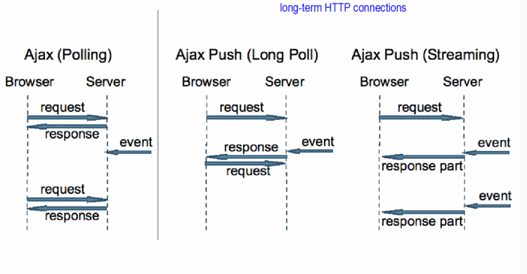

# polling

> 폴링(polling)이란 하나의 장치(또는 프로그램)가 충돌 회피 또는 `**동기화 처리**` 등을 목적으로 다른 장치(또는 프로그램)의 상태를 **`주기적으로 검사`**하여 일정한 조건을 만족할 때 송수신 등의 자료처리를 하는 방식을 말한다. 이 방식은 버스, 멀티포인트 형태와 같이 여러 개의 장치가 동일 회선을 사용하는 상황에서 주로 사용된다. 서버의 제어 장치(또는 프로그램)는 순차적으로 각 단말 장치(또는 프로그램)에 회선을 사용하기 원하는지를 물어본다. by 위키백과

⇒ 정리하자면, 

- 동기화 처리를 목적으로, 주기적으로 서버에 요청을보내서 데이터를 가져오는 방식

## Long-polling

- 롱폴링 방식은 기본적인 폴링방식과 유사하지만, 서버에서 웹으로부터 온 요청을 hang 하고 있다는 점에서 차이가 있다.
- 변화없는, 혹은 빈 데이터를 respone 해주는것이 아니라, 해당 데이터에 이벤트가 발생했을때까지 요청을 들고 있다가, 이벤트가 발생하거나, 최대 timeout 시간이 지날경우 클라이언트에게 respone을 보낸다.
- 클라이언트에서 주기적으로 요청을 보내는 기본적인 폴링 방식에 비해서, 이벤트가 발생했을 경우 요청을 보내주기 때문에 실시간성을 유지할 수 있다.
- 요청을 hang 하고 있어야 하기 때문에, 서비스의 성격, 요청의 주기 등에 따라서, 서버에 큰 부하를 줄수도, 부하를 덜어줄 수도 있다.
- 예를들어, 1:1 채팅의 경우에는 롱폴링 방식을 사용하면, 두 개의 요청을 들고 있고 새로운 이벤트(채팅)이 발생시마다 각각의 요청에 리스폰을 전하면 되기 때문에 실시간 채팅을 구현할 수 있다.
- 반면 100명 짜리 채팅방을 구현할 경우, 100개의 요청을 hang 하고 있고, 누군가 새로운 이벤트를 발생시켰을 경우(채팅) 동시에 100개의 요청에 응답을 보내야 하고, 응답을 다시 보낸다 하더라도, 새로운 hang을 위한 요청 100개가 동시에 들어올 것이기 때문에 서비스 구조에따라서, 자체적인 DDos 공격을 만들어버릴 수 도 있다.

<!--  -->
- 
## 그렇다면 언제?

- Long-Polling
    - 실시간 응답이 중요한 경우
    - http 응답에 있어서 그 respone 에 대한 부하가 클 경우.
    - 서버의 상태변경이 빈번하지 않은 경우 적합

- Polling
    - 요청에대한 서버부담이 크지 않을 경우
    - 실시간에 대한 요구가 크지 않은 경우

## 그래서 우리는?

- 오가는 데이터 자체의 볼륨은 문서,사진 등과 같이 볼륨이 큰 데이터는 아니기 때문에 크지 않은 편, 다만 aggregate 로직에 관한 부하는 미지수.
- 서버의 상태 변경이, 경우에따라서는 매우 빈번할 수도, 혹은 없을 수도.
- 엄청난 실시간이 필요하지는 않음.
- 10명의 관리자가 판옵티콘을 사용하고 있고, 100명의 사용자로부터 연속적인 에러가 10번 발생한다면,  총 20000번의 요청을  보내야하는 상황이 발생하게됨.
- 또한 웹 서비스라는 특성상, 하나의 프로젝트만 관리하는 것이 아니기 때문에, 다수의 판옵티콘 사용을 가정한다면, hang하고 있어야 하는 요청의 갯수도 서버에 큰 부하를 줄 수도.

## 결론

그냥 인터벌을 두고 데이터를 가져오는 것이 서비스 구조상 적합해 보임